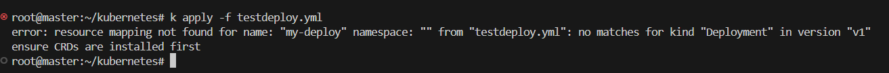
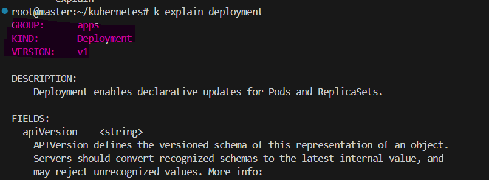
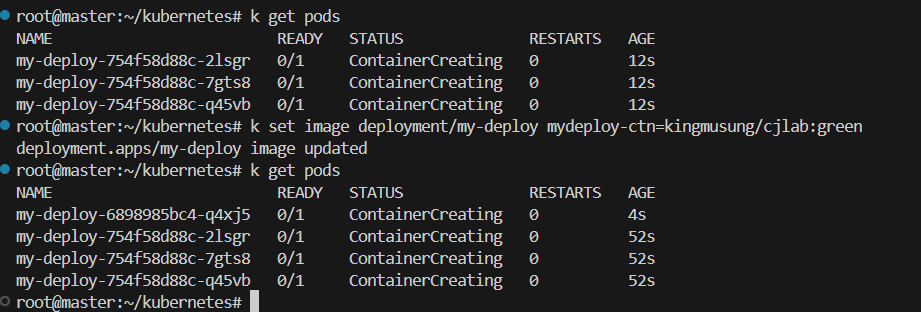

# 문제 1) 해당 부분에서 틀린 부분을 찾고 왜 그런지 설명

## 경로 : testdeploy.yml 
```
apiVersion: v1
kind: Deployment
metadata:
  name: my-deploy
  labels:
    app: myapp
spec:
  replicas: 3
  selector:
    matchLabels:
      color: blue  # 나는 이러한 key: value 를 갖는 Pod 를 3개 유지할게!!! (controller가 담당)
  template:       # 실제적인 Pod 의 구성 정보
    metadata:
      labels:
        color: blue
    spec:
      containers:
        - name: mydeploy-ctn
          image: brian24/cjlab:blue
          ports:
          - containerPort: 80
          resources:
            limits:
              memory: "64Mi"
              cpu: "500m"
            requests:
              memory: "32Mi"
              cpu: "250m"
```



## 문제점

버전 문제인걸 확인 할 수 있음.

<div style="border-left: 5px solid #4e9f3d; background-color: black; padding: 10px; margin: 10px 0;">
  <span style="color: white;">워크로드들의 모든 버전을 외우지 말고 명령어를 통해 확인하자, 버전에 따라 바뀔 수 있으므로 트러블이 일어난다면 버전부터 확인해보자.

  ```
  kubectl explain <워크로드>
  ```

  </span>
</div>



## 문제 1-2) 베포중인 컨테이너의 이미지를 DockerHub에 있는 이미지로 바꾸고 deployment의 기본 베포전략은은

```
kubectl set image deployment/<리소스이름> <컨테이너이름>=kingmusung/cjlab:green
```

```
kubectl set image deployment/my-deploy mydeploy-ctn=kingmsung/cjlab:green
```



Rolling Update방식을 사용한다다

<div style="border-left: 5px solid #4e9f3d; background-color: black; padding: 10px; margin: 10px 0;">
  <span style="color: white;">Rolling Update를 사용한다.

  </span>
</div>

# 해당 YML에 대해 설명하고 
